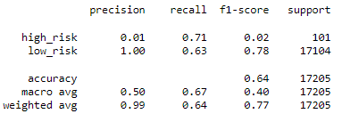
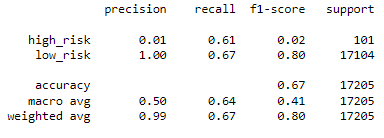
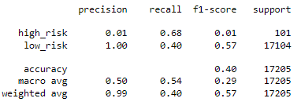
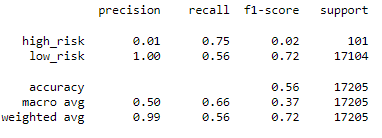
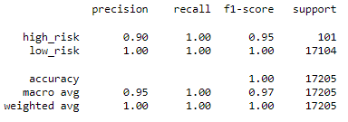
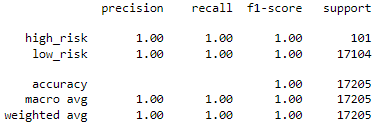

# Credit_Risk_Analysis
## Overview of the loan prediction risk analysis
The purpose of this analysis was to evaluate different classification models for predicting credit risk.
## Results
* RandomOverSampler
** Accuracy: 0.64
** 
* SMOTE
** Accuracy: 0.67
** 
* ClusterCentroids
** Accuracy: 0.40
** 
* SMOTEENN
** Accuracy: 0.56
** 
* BalancedRandomForrestClassifier
** Accuracy: 0.999
** 
* EasyEnsembleClassifier
** Accuracy: 1.0
** 
## Summary
